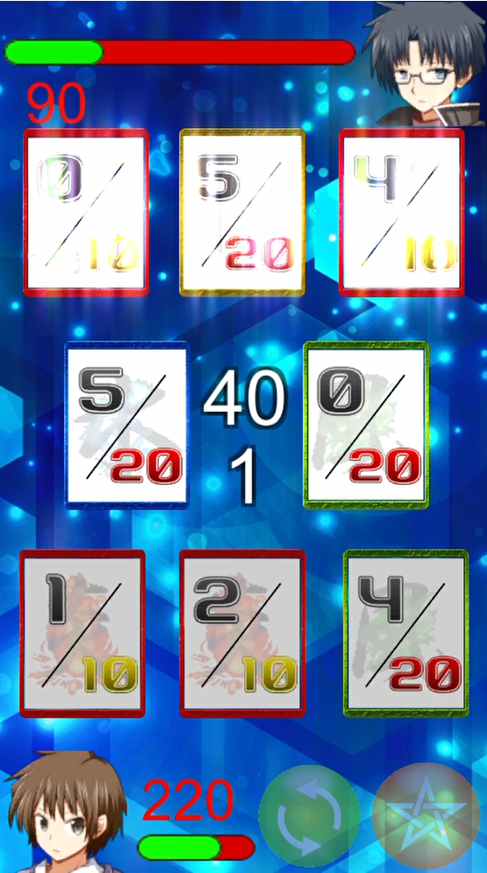

AmusementCreatorsゲーム集の内の一つとして、C97にてα版頒布。  
2020年度U22プログラミングコンテストにてβ版提出。  
現在開発続行中

Elemental Speed Neoは、スピードを基にしたターン性カードゲームです。Unity製の2Dゲームであり、CPU対戦の他、Photon Engineの利用によるオンライン対戦を実装しています。開発は個人で行っています。

対戦は2人で行われ、それぞれがHPを持ちます。相手のHPを0にすれば勝ちとなります。カードには通常の数字の他に、属性と攻撃力があり、場に出すことで相手にダメージを与えることができます。また、属性には相性があり、場のカードに対して相性が良ければダメージが2倍になります。カードを場に出せるのはお互いに限られたタイミングであり、これは交互に切り替わります(ターン制)。自分のターンにはカードを場に出す他に、手札を入れ替えるシャッフルとキャラクター毎に異なった効果のスキルを使用することができます。

現在はオンライン対戦時の通信内容を最適化するためのリファクタリングに取り組んでいます。

<table>
<tr>
<td></td>
<td></td>
</tr>
</table>