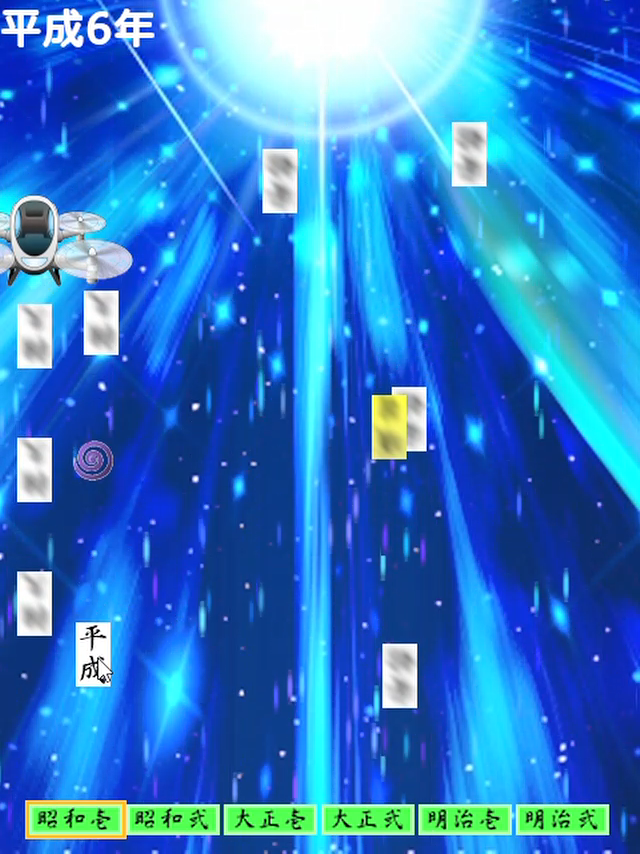

AmusementCreatorsゲーム集の内の一つとして、C95にて頒布。

Ever Lasting HEISEI ～平成よ永遠に～は、平成最後のコミケにちなんだネタシューティングゲームです。エンドレスのスコアアタックシューティングですが、スコアは途中でリタイアしなければ0になる点や、スコアに応じたコメントを表示する点など、単調にならずに楽しめるような工夫をしています。一番のこだわりはもちろん、ネタをどれだけゲームに落とし込んだかという所ですが、それを説明するのは苦しいのでここでは省略します。

このゲームはAmusementCreatorsで開発されたAltseedというコードベースのゲームエンジンを用いてC#で制作しました。

<table>
<tr>
<td></td>
<td></td>
</tr>
</table>